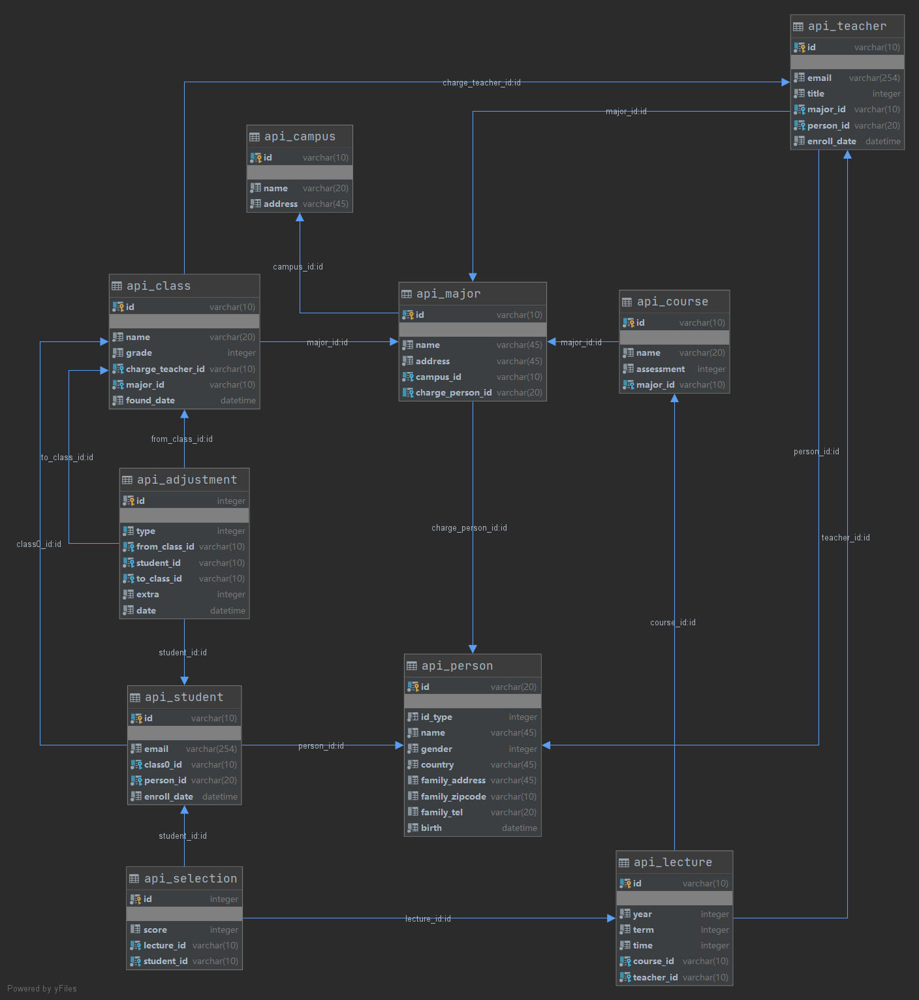

#### 后端

后端设计主要分为 3 个部分

1. 数据库模型
2. API 设计与实现
3. 登陆与权限

具体设计流程为：根据实验要求设计模型（参照lab2）——> 将这个模型用 Django ORM 进行表示（见backend/api/models.py）——>根据前端要求和实验要求设计REST API（login/logout, 以及各种数据的增删查改）——> 实现这些 API.

##### 数据库模型

后端使用 Django+MySQL 实现，数据库使用 Django ORM 实现交互，数据库后端使用 MySQL.

使用的数据库模型设计和 lab2 一样，具体的模型如下：



模型一共使用了 Campus、Person、Major、Teacher、Class、Student、Course、Lecture、Selection、Adjustment 这 10 个表。

1. Campus 存储校区相关信息，有 `id`, `name`, `address`.

2. Person 存储个人信息，有 `id`, `id_type`(0=id_card, 1=passport), `name`, `gender`(0=male,1=female), `country`, `birth`, `family_address`, `family_zipcode`, `familt_tel`.

3. Major 存储专业信息，有 `id`, `name`, `campus_id`(外键引用 Campus), `charge_person_id`(外键引用 Person).

4. Teacher 存储教师信息，有 `id`, `email`, `emroll_date`, `title`(0=professor, 1=vice_professor), `major_id`(外键引用 Major), `person_id`(外键引用 Person，设置为 `on delete cascade`).

5. Class 存储班级信息，有 `id`, `name`, `grade`(1~4), `found_date`, `major_id`(外键引用 Major), `charge_teacher_id`(外键引用 Teacher).

6. Student 存储学生信息，有 `id`, `email`, `enroll_date`, `class_id`(外键引用 Class), `person_id`(外键引用 Person，设置为 `on delete cascade`).

7. Course 存储课程信息，有 `id`, `name`, `assessment`(0=exam,1=reply), `major_id`(外键引用 Major).

8. Lecture 存储开课信息，有 `id`, `year`, `term`(0=spring,1=autumn), `time`(两位数字，十位代表星期几，个位代表第几节课), `course_id`(外键引用 Course), `teacher_id`(外键引用 Teacher).

9. Selection 存储选课信息，有 `lecture_id`(外键引用 Lecture), `student_id`(外键引用 Student，设置为 `on delete cascade`), `score`. `lecture_id` 和 `student_id` 联合作为主键.

10. Adjustment 存储学籍异动信息，有 `student_id`(外键引用 Student，设置为 `on delete cascade`), `type`(0=change_major, 1=downgrade), `from_class_id`, `to_class_id`, `date`, `extra`. `type=0` 时 `extra` 代表团员关系变化，可选 `0`(yes)、`1`(no)、`2`(none), `type=1` 时 `extra` 代表降级原因，可选 `0`(suspend)、`1`(support teaching). `student_id` 和 `type` 联合作为主键。

`on delete cascade` 的设置完全参照饰演的模型要求。所有没设置为，`on delete cascade` 的外键，其引用条目的删除都会被禁止并返回错误。

然后使用 Django ORM 来实现以上模型。具体代码见 `backend/api/models.py`.

##### API 设计与实现

###### API 设计

本项目采用前后端分离的架构，前端通过请求 API 来实现数据库的增删查改。API 设计如下：

```
GET  api/<function>/<action>?<params list>
POST  api/<function>/<action>     body=<json> 
```

`<function>` 有 `campus`, `major`, `class`, `teacher`, `student`, `course`, `lecture`, `selection`，`adjustment` 可选.

`<action>` 有 `get`(查), `add`(增), `del`(删), `mod`(改) 可选。 其中 `get` 和 `del` 操作需要用 `GET` 方法请求，`add` 和 `mod` 需要用 `POST` 方法请求。

`GET` 方法请求时，直接用 url 进行筛选字段的参数传递，如

```
GET  api/major/get?id=major1&name=east
```  

`POST` 方法请求时，在 body 中写入 json 数据来传递参数，如

- `add` 动作 `POST  api/major/add  body={'id':'major2','name':'west','address':'west'}`
  
- `mod` 动作

   ```
   POST  api/major/mod
   body = {
     "where":{
       // 筛选字段
     },
     "update":{
       // 可更新字段
     }
   }
   ```

`api/<function>/get` 返回格式如下：

- 成功
  ```json
  {
    "code": 1,
    "list": [
      {
        // 返回字段
      },
      //...  
    ]
  }
  ```
  
- 失败
  ```json
  {"code": 0, "msg": "失败原因"}
  ```
  
其他 `action` 请求成功时则不返回 `list` 字段。

定义：**筛选字段**为 `get`, `del` 请求中传递的参数，以及 `mod` 中放到 `where` 域中的字段，**返回字段**是 `get` 方法返回的 `list` 中每个条目的字段，**可更新字段**是放到 `mod` 请求中放到 `update` 域中或 `add` 时携带的字段。

**`add` 方法请求时，除了那些可以为 `null` 的字段，其他的可更新字段，外加 `id` 都必须被携带（model 中没特意说明的字段都为 `not null`）。**

**实验文档要求部分 `id` 域无法修改，这时 `mod` 的 `update` 域中不能有 `id`.**

**Person 不提供独立的管理接口，和 Student/Teacher 一起管理。**

下面是每种 `function` 和 `action` 的参数定义：

1. `function=campus`
   筛选字段和返回字段为 `id`,`name`,`address`. 可更新字段去掉 `id`.

2. `function=major`
   筛选字段有 `id`, `name`, `address`, `campus_id`, `charge_person_id`. 可更新字段去掉 `id`.
   返回字段除了以上筛选字段，还有 `campus_name`, `charge_person_name`.

3. `function=class`
   筛选字段有 `id`, `name`, `found_date`, `grade`, `major_id`, `charge_teacher_id`. 可更新字段去掉 `id`.
   返回字段除了以上，还有 `major_name`, `charge_teacher_name`.
  
4. `function=student`
   筛选字段和返回字段有 `id`, `enroll_date`, `email`, `class_id`, `class_name`, `major_id`, `major_name`, `person_id`, `person_name`, `person_id_type`, `gender`, `birth`, `country`, `family_address`, `family_zipcode`, `family_tel`.
   可更新字段有 `enroll_date`, `email`, `class_id`, `person_id`, `person_name`, `person_id_type`, `gender`, `birth`, `country`, `family_address`, `family_zipcode`, `family_tel`, `password`.

5. `function=teacher`
   筛选字段和返回字段有 `id`, `enroll_date`, `email`, `title`, `major_id`, `major_name`, `person_id`, `person_name`, `person_id_type`, `gender`, `birth`, `country`, `family_address`, `family_zipcode`, `family_tel`.
   可更新字段有 `enroll_date`, `email`, `title`, `major_id`, `person_id`, `person_name`, `person_id_type`, `gender`, `birth`, `country`, `family_address`, `family_zipcode`, `family_tel`, `password`.

6. `function=course`
   筛选字段有 `id`, `name`, `assessment`, `major_id`. 可更新字段去掉 `id`.
   返回的字段除了以上，还有 `major_name`.

7. `function=lecture`
   筛选字段有 `id`, `course_id`, `teacher_id`, `year`, `term`, `time`. 可更新字段去掉 `id`.
   返回字段除了以上，还有 `course_name`, `assessment`, `major_name`, `teacher_name`.

8. `function=selection`
   筛选字段和可更新字段有 `lecture_id`, `student_id`, `score`.
   返回字段除了以上，还有 `course_name`, `teacher_name`, `student_name`.

9. `function=adjustment`
   筛选字段和可更新字段 `student_id`, `type`, `date`, `from_class_id`, `to_class_id`, `extra`.
   返回的字段除了以上，还有 `from_class_name`, `to_class_name`, `student_name`.

###### API 实现

以下用 Major 的管理为例，讲一下 API 的实现：

<!-- 程序输入为 `api/student/<action>` 的 `HttpRequest`(格式见 API 调用约定)。 -->

流程为：路由表-->请求接受-->权限验证-->字段检查-->数据库操作-->返回数据。

<!-- 程序输出为 `action` 所返回的数据(格式见 API 调用约定)。 -->

路由表：
```python
urlpatterns = [
    path('major/get', major.get),
    path('major/add', major.add),
    path('major/del', major.delete),
    path('major/mod', major.mod),
]
```

字段筛选：
```python
where_params = ['id', 'name', 'address', 'campus_id', 'charge_person_id']

def check_params(params: dict) -> dict:
    return {
        k: v
        for k, v in params.items()
        if k in where_params
    }
```


权限验证 & 数据库操作 & 返回数据：

**权限验证用 decorator (如 `@check_login`) 实现(登陆与权限部分会细讲)**

```python
@check_login
def get(request: HttpRequest):
    params = check_params(request.GET.dict())
    result = Major.objects.filter(**params).values(
        *where_params,
        campus_name=F('campus__name'), charge_person_name=F('charge_person__name')
    )
    return response_success(list(result))

@check_admin
def add(request: HttpRequest):
    params = json.loads(request.body.decode())
    params = check_params(params)
    return general_add(Major, params)

@check_admin
def delete(request: HttpRequest):
    params = check_params(request.GET.dict())
    return general_del(Major, params)

@check_admin
def mod(request: HttpRequest):
    params = json.loads(request.body.decode())
    where = check_params(params.get('where', {}))
    update = check_params(params.get('update', {}))
    return general_mod(Major, where, update)
```

##### 登陆与权限

后端 API 需要登陆才能进行请求。

登录基于 cookie 技术，即前端请求后端的登录接口时，后端返回一个字符串作为 cookie, 之后前端每次请求时都带上 cookie, 后端就能通过 cookie 来判断请求来源的身份信息。登出后后端删除这个 cookie 的授权。

###### 登录

登陆需要 `username` 与 `password`

方便起见，我们在登录页面上输入的是 admin/`student_id`/`teacher_id` 作为 `id`, 后端用 `student_id`/`teacher_id` 先查询到 `person_id` 作为 `username`, 这可以保证唯一性。

登录和登出的接口如下：

登录：`POST  api/login  body={"id":"xxx","password":"xxxxx"}` 

若成功验证，则返回

```json
{
  "code": 1,
  "type": type, // 0 代表 admin, 1 代表 teacher, 2 代表 student
  // type =1/2 时才有下面两个字段  
  "id": "xxx", // teacher_id/student_id
  "person_id": "xxx"
}
```

登陆失败则返回

```json
{"code": 0, "msg": "失败原因"}
```

登出：`GET  api/logout`.

登录验证的流程如下：

接受请求-->检查参数-->判断 `id` 类别-->检验密码-->设置 cookie -->返回结果。

代码如下：

```python
def login(request: HttpRequest):
    # 检查参数
    params = json.loads(request.body.decode())
    if 'id' not in params:
        return response_error('missing id')
    if 'password' not in params:
        return response_error('missing password')
    id = params['id']
    password = params['password']
    # 判断 id 类别
    teacher = Teacher.objects.filter(id=id)
    student = Student.objects.filter(id=id)
    if id == 'admin':
        username = id
        type = 0
    elif teacher.exists():
        username = teacher.values('person_id')[0]['person_id']
        type = 1
    elif student.exists():
        username = student.values('person_id')[0]['person_id']
        type = 2
    else:
        return response_error(f'can not find {id}')
    # 验证密码
    user = auth.authenticate(username=username, password=password)
    if user is None:  # 验证失败
        return response_error('wrong password')
    # 记录登录 & 设置 cookie
    auth.login(request, user)
    # 返回结果
    return JsonResponse({
        'code': 1,
        'type': type,
        'id': id,
        'person_id': username
    })

def logout(request: HttpRequest):
    auth.logout(request)
    return response_success()
```

###### 权限

不同的 API 需要不同的权限才能请求，大致有三类：

1. 任意用户登录即可请求
2. admin 才能请求
3. admin 能请求，或需要登陆的 `person_id` 与被请求数据所属的 `person_id` 一致才能请求

API 的权限要求如下表：

|              | `get` | `add` | `del` | `mod` |
| :----------: | :---: | :---: | :---: | :---: |
|   `campus`   |   1   |   2   |   2   |   2   |
|   `major`    |   1   |   2   |   2   |   2   |
|   `class`    |   1   |   2   |   2   |   2   |
|   `course`   |   1   |   2   |   2   |   2   |
|  `lecture`   |   1   |   3   |   3   |   3   |
|  `teacher`   |   3   |   2   |   2   |   3   |
|  `student`   |   3   |   2   |   2   |   3   |
| `selection`  |   3   |   3   |   3   |   3   |
| `adjustment` |   3   |   2   |   2   |   2   |

从请求的 cookies 信息可以判断请求的用户登陆状态与身份，用以权限检查。

为了方便地给 API 请求处理函数，使用 python 的 decorator 功能，编写三种检查权限的 decorator:

```python
# 检查是否登录，对应 1
def check_login(func):
    def wrapper(request: HttpRequest, *args, **kw):
        if request.user.is_authenticated: # 判断是否登录
            return func(request, *args, **kw)
        else:
            return response_error('login required', status=403)
    return wrapper

# 检查是否是 admin, 对应等级 2
def check_admin(func):
    def wrapper(request: HttpRequest, *args, **kw):
        if request.user.is_staff: # 判断是否是 admin
            return func(request, *args, **kw)
        else:
            return response_error('permission denied', status=403)
    return wrapper

# 检查等级 3, 这里以 student/get 的检查为例
def check_permission(func):
    def wrapper(request: HttpRequest, *args, **kw):
        if not request.user.is_authenticated: # 判断是否登录
            return response_error('login required', status=403)
        if request.user.is_staff: # 判断 admin
            return func(request, *args, **kw)
        if request.method == 'GET':
            params = check_params(request.GET.dict())
        elif request.method == 'POST':
            params = json.loads(request.body.decode())
            params = check_params(params.get('where', {}))
        else:
            return response_error('method denied')
        # 获取要请求的数据的 person_id
        query = Student.objects.filter(**params).values('person_id')
        person_id_list = list({item['person_id'] for item in query})
        # 当且仅当请求的自身的 person_id 对应的数据时，才返回正常
        if len(person_id_list) == 0 or (len(person_id_list) == 1 and person_id_list[0] == request.user.get_username):
            return func(request, *args, **kw)
        # permission denied
        return response_error('permission denied', status=403)
    return wrapper
```

使用时如下：

```python
@check_login  # major/get
def get(request: HttpRequest):
    # .....

@check_admin  # major/add
def add(request: HttpRequest):
    # .....

@check_permission # student/get
def get(request: HttpRequest):
    # .....
```
