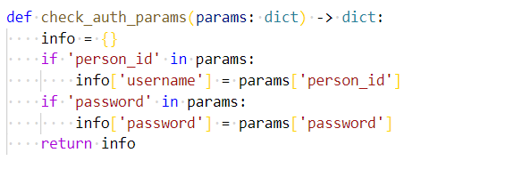
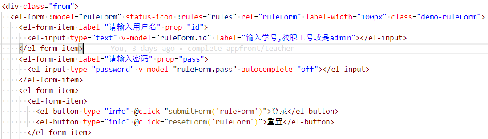
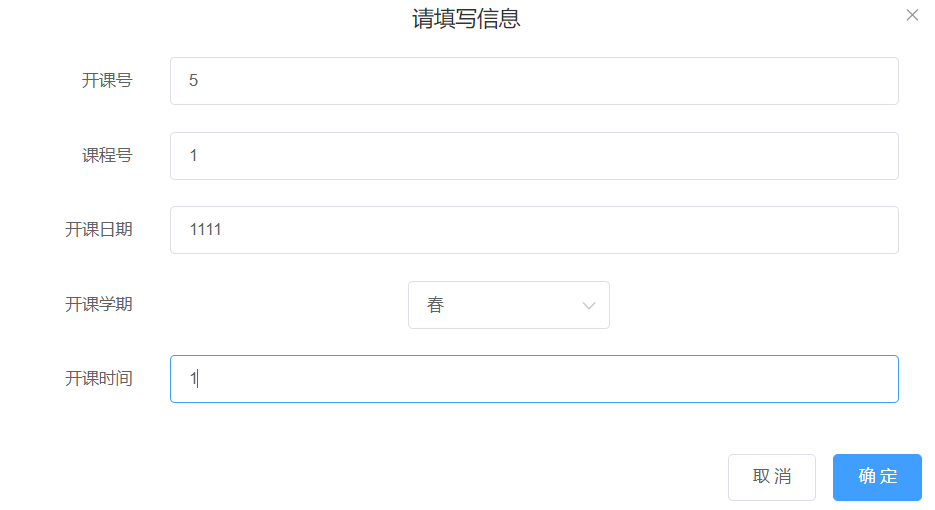
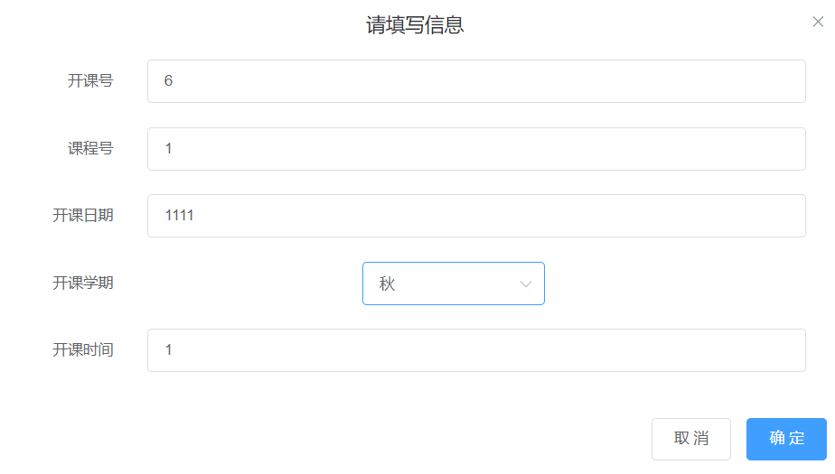

## 数据库lab3 教务系统开发

<center> 第9组     a类</center>

### 一、小组成员及分工
组长：虞佳焕

组员：王宇，凃才畅，孙智鹏

### 二、概述
#### 1、搭建环境

系统：windows 10

软件：PyCharm 2020.1 x64专业版


#### 2、业务功能简述

按照实验要求设计了一个基于vue.js + django + mysql的教务管理系统，数据库部分使用了Django 的 ORM 模型，把用户分为学生用户（可查看个人信息，选课），老师用户（可查看个人信息，开课）和管理员用户（可管理校区、专业、班级、学生信息、学籍异动、教师信息等等），实现了在相应权限下各项管理的增、删、改、查功能。

### 三、系统总体设计
#### 3.1 后端设计


后端设计主要分为 3 个部分

1. 数据库模型
2. API 设计与实现
3. 登陆与权限

具体设计流程为：根据实验要求设计模型（参照lab2）——> 将这个模型用 Django ORM 进行表示（见backend/api/models.py）——>根据前端要求和实验要求设计REST API（login/logout, 以及各种数据的增删查改）——> 实现这些 API.

#### 3.2 前端设计

前端使用vue.js渲染页面，根据实验要求，按照用户权限分成了teacher,student,manager三个主要模块，对应于学生，教师和管理员的操作视图以及一个面向所有用户login模块。由于teacher,student和manager拥有的权限不同，针对三者各自设计不同的vue主页和对应的跳转页面。

+ student模块：首先是主界面的设计，包括一些提示语和对应的侧边栏。每个侧边栏的条目都指示对应的功能页面，打开侧边栏，则可以选择student对应的功能：查看个人信息，查看班级信息，进行选课管理。

+ teacher模块：基本与student类似，除了对应的功能变为：查看个人信息，进行开课管理。

+ manager模块：较为复杂，侧边栏指示manager对应的共9项管理功能：账户信息管理，校区管理，专业管理，班级管理，学生信息管理，学籍异动管理，教师信息管理，课程管理，开课管理和选课管理。
值得一提的是，manager不仅拥有student和teacher的选课和开课管理功能，而且更进一步，可以操作所有的开课、选课信息，而student和teacher只能操纵各自对应的信息。

具体设计流程：根据实验要求细分页面（login，manager，teacher和student）——>设计三个母页面的样式，采用侧边菜单栏的方式展开子页面目录——>根据实验功能实现要求，分别添加功能管理的子页面的样式和连接——>实现这些页面和后端的交互

### 四、系统详细设计

#### 4.1 后端模型设计和数据库实体

##### 数据库模型

后端使用 Django+MySQL 实现，数据库使用 Django ORM 实现交互，数据库后端使用 MySQL.

使用的数据库模型设计和 lab2 一样，具体的模型如下：


模型一共使用了 Campus、Person、Major、Teacher、Class、Student、Course、Lecture、Selection、Adjustment 这 10 个表。

1. Campus 存储校区相关信息，有 `id`, `name`, `address`.

2. Person 存储个人信息，有 `id`, `id_type`(0=id_card, 1=passport), `name`, `gender`(0=male,1=female), `country`, `birth`, `family_address`, `family_zipcode`, `familt_tel`.

3. Major 存储专业信息，有 `id`, `name`, `campus_id`(外键引用 Campus), `charge_person_id`(外键引用 Person).

4. Teacher 存储教师信息，有 `id`, `email`, `emroll_date`, `title`(0=professor, 1=vice_professor), `major_id`(外键引用 Major), `person_id`(外键引用 Person，设置为 `on delete cascade`).

5. Class 存储班级信息，有 `id`, `name`, `grade`(1~4), `found_date`, `major_id`(外键引用 Major), `charge_teacher_id`(外键引用 Teacher).

6. Student 存储学生信息，有 `id`, `email`, `enroll_date`, `class_id`(外键引用 Class), `person_id`(外键引用 Person，设置为 `on delete cascade`).

7. Course 存储课程信息，有 `id`, `name`, `assessment`(0=exam,1=reply), `major_id`(外键引用 Major).

8. Lecture 存储开课信息，有 `id`, `year`, `term`(0=spring,1=autumn), `time`(两位数字，十位代表星期几，个位代表第几节课), `course_id`(外键引用 Course), `teacher_id`(外键引用 Teacher).

9. Selection 存储选课信息，有 `lecture_id`(外键引用 Lecture), `student_id`(外键引用 Student，设置为 `on delete cascade`), `score`. `lecture_id` 和 `student_id` 联合作为主键.

10. Adjustment 存储学籍异动信息，有 `student_id`(外键引用 Student，设置为 `on delete cascade`), `type`(0=change_major, 1=downgrade), `from_class_id`, `to_class_id`, `date`, `extra`. `type=0` 时 `extra` 代表团员关系变化，可选 `0`(yes)、`1`(no)、`2`(none), `type=1` 时 `extra` 代表降级原因，可选 `0`(suspend)、`1`(support teaching). `student_id` 和 `type` 联合作为主键。

`on delete cascade` 的设置完全参照饰演的模型要求。所有没设置为，`on delete cascade` 的外键，其引用条目的删除都会被禁止并返回错误。

然后使用 Django ORM 来实现以上模型。具体代码见 `backend/api/models.py`.

##### API 设计与实现

###### API 设计

本项目采用前后端分离的架构，前端通过请求 API 来实现数据库的增删查改。API 设计如下：

```
GET  api/<function>/<action>?<params list>
POST  api/<function>/<action>     body=<json> 
```

`<function>` 有 `campus`, `major`, `class`, `teacher`, `student`, `course`, `lecture`, `selection`，`adjustment` 可选.

`<action>` 有 `get`(查), `add`(增), `del`(删), `mod`(改) 可选。 其中 `get` 和 `del` 操作需要用 `GET` 方法请求，`add` 和 `mod` 需要用 `POST` 方法请求。

`GET` 方法请求时，直接用 url 进行筛选字段的参数传递，如

```
GET  api/major/get?id=major1&name=east
```  

`POST` 方法请求时，在 body 中写入 json 数据来传递参数，如

- `add` 动作 `POST  api/major/add  body={'id':'major2','name':'west','address':'west'}`
  
- `mod` 动作

   ```
   POST  api/major/mod
   body = {
     "where":{
       // 筛选字段
     },
     "update":{
       // 可更新字段
     }
   }
   ```

`api/<function>/get` 返回格式如下：

- 成功
  ```json
  {
    "code": 1,
    "list": [
      {
        // 返回字段
      },
      //...  
    ]
  }
  ```
  
- 失败
  ```json
  {"code": 0, "msg": "失败原因"}
  ```
  
其他 `action` 请求成功时则不返回 `list` 字段。

定义：**筛选字段**为 `get`, `del` 请求中传递的参数，以及 `mod` 中放到 `where` 域中的字段，**返回字段**是 `get` 方法返回的 `list` 中每个条目的字段，**可更新字段**是放到 `mod` 请求中放到 `update` 域中或 `add` 时携带的字段。

**`add` 方法请求时，除了那些可以为 `null` 的字段，其他的可更新字段，外加 `id` 都必须被携带（model 中没特意说明的字段都为 `not null`）。**

**实验文档要求部分 `id` 域无法修改，这时 `mod` 的 `update` 域中不能有 `id`.**

**Person 不提供独立的管理接口，和 Student/Teacher 一起管理。**

下面是每种 `function` 和 `action` 的参数定义：

1. `function=campus`
   筛选字段和返回字段为 `id`,`name`,`address`. 可更新字段去掉 `id`.

2. `function=major`
   筛选字段有 `id`, `name`, `address`, `campus_id`, `charge_person_id`. 可更新字段去掉 `id`.
   返回字段除了以上筛选字段，还有 `campus_name`, `charge_person_name`.

3. `function=class`
   筛选字段有 `id`, `name`, `found_date`, `grade`, `major_id`, `charge_teacher_id`. 可更新字段去掉 `id`.
   返回字段除了以上，还有 `major_name`, `charge_teacher_name`.
  
4. `function=student`
   筛选字段和返回字段有 `id`, `enroll_date`, `email`, `class_id`, `class_name`, `major_id`, `major_name`, `person_id`, `person_name`, `person_id_type`, `gender`, `birth`, `country`, `family_address`, `family_zipcode`, `family_tel`.
   可更新字段有 `enroll_date`, `email`, `class_id`, `person_id`, `person_name`, `person_id_type`, `gender`, `birth`, `country`, `family_address`, `family_zipcode`, `family_tel`, `password`.

5. `function=teacher`
   筛选字段和返回字段有 `id`, `enroll_date`, `email`, `title`, `major_id`, `major_name`, `person_id`, `person_name`, `person_id_type`, `gender`, `birth`, `country`, `family_address`, `family_zipcode`, `family_tel`.
   可更新字段有 `enroll_date`, `email`, `title`, `major_id`, `person_id`, `person_name`, `person_id_type`, `gender`, `birth`, `country`, `family_address`, `family_zipcode`, `family_tel`, `password`.

6. `function=course`
   筛选字段有 `id`, `name`, `assessment`, `major_id`. 可更新字段去掉 `id`.
   返回的字段除了以上，还有 `major_name`.

7. `function=lecture`
   筛选字段有 `id`, `course_id`, `teacher_id`, `year`, `term`, `time`. 可更新字段去掉 `id`.
   返回字段除了以上，还有 `course_name`, `assessment`, `major_name`, `teacher_name`.

8. `function=selection`
   筛选字段和可更新字段有 `lecture_id`, `student_id`, `score`.
   返回字段除了以上，还有 `course_name`, `teacher_name`, `student_name`.

9. `function=adjustment`
   筛选字段和可更新字段 `student_id`, `type`, `date`, `from_class_id`, `to_class_id`, `extra`.
   返回的字段除了以上，还有 `from_class_name`, `to_class_name`, `student_name`.

###### API 实现

以下用 Major 的管理为例，讲一下 API 的实现：

<!-- 程序输入为 `api/student/<action>` 的 `HttpRequest`(格式见 API 调用约定)。 -->

流程为：路由表-->请求接受-->权限验证-->字段检查-->数据库操作-->返回数据。

<!-- 程序输出为 `action` 所返回的数据(格式见 API 调用约定)。 -->

路由表：
```python
urlpatterns = [
    path('major/get', major.get),
    path('major/add', major.add),
    path('major/del', major.delete),
    path('major/mod', major.mod),
]
```

字段筛选：
```python
where_params = ['id', 'name', 'address', 'campus_id', 'charge_person_id']

def check_params(params: dict) -> dict:
    return {
        k: v
        for k, v in params.items()
        if k in where_params
    }
```


权限验证 & 数据库操作 & 返回数据：

**权限验证用 decorator (如 `@check_login`) 实现(登陆与权限部分会细讲)**

```python
@check_login
def get(request: HttpRequest):
    params = check_params(request.GET.dict())
    result = Major.objects.filter(**params).values(
        *where_params,
        campus_name=F('campus__name'), charge_person_name=F('charge_person__name')
    )
    return response_success(list(result))

@check_admin
def add(request: HttpRequest):
    params = json.loads(request.body.decode())
    params = check_params(params)
    return general_add(Major, params)

@check_admin
def delete(request: HttpRequest):
    params = check_params(request.GET.dict())
    return general_del(Major, params)

@check_admin
def mod(request: HttpRequest):
    params = json.loads(request.body.decode())
    where = check_params(params.get('where', {}))
    update = check_params(params.get('update', {}))
    return general_mod(Major, where, update)
```

##### 登陆与权限

后端 API 需要登陆才能进行请求。

登录基于 cookie 技术，即前端请求后端的登录接口时，后端返回一个字符串作为 cookie, 之后前端每次请求时都带上 cookie, 后端就能通过 cookie 来判断请求来源的身份信息。登出后后端删除这个 cookie 的授权。

###### 登录

登陆需要 `username` 与 `password`

方便起见，我们在登录页面上输入的是 admin/`student_id`/`teacher_id` 作为 `id`, 后端用 `student_id`/`teacher_id` 先查询到 `person_id` 作为 `username`, 这可以保证唯一性。

登录和登出的接口如下：

登录：`POST  api/login  body={"id":"xxx","password":"xxxxx"}` 

若成功验证，则返回

```json
{
  "code": 1,
  "type": type, // 0 代表 admin, 1 代表 teacher, 2 代表 student
  // type =1/2 时才有下面两个字段  
  "id": "xxx", // teacher_id/student_id
  "person_id": "xxx"
}
```

登陆失败则返回

```json
{"code": 0, "msg": "失败原因"}
```

登出：`GET  api/logout`.

登录验证的流程如下：

接受请求-->检查参数-->判断 `id` 类别-->检验密码-->设置 cookie -->返回结果。

代码如下：

```python
def login(request: HttpRequest):
    # 检查参数
    params = json.loads(request.body.decode())
    if 'id' not in params:
        return response_error('missing id')
    if 'password' not in params:
        return response_error('missing password')
    id = params['id']
    password = params['password']
    # 判断 id 类别
    teacher = Teacher.objects.filter(id=id)
    student = Student.objects.filter(id=id)
    if id == 'admin':
        username = id
        type = 0
    elif teacher.exists():
        username = teacher.values('person_id')[0]['person_id']
        type = 1
    elif student.exists():
        username = student.values('person_id')[0]['person_id']
        type = 2
    else:
        return response_error(f'can not find {id}')
    # 验证密码
    user = auth.authenticate(username=username, password=password)
    if user is None:  # 验证失败
        return response_error('wrong password')
    # 记录登录 & 设置 cookie
    auth.login(request, user)
    # 返回结果
    return JsonResponse({
        'code': 1,
        'type': type,
        'id': id,
        'person_id': username
    })

def logout(request: HttpRequest):
    auth.logout(request)
    return response_success()
```

###### 权限

由于管理功能较多，列举诸多模型代码意义不大，这里只展示学生信息管理功能student的实现作为示例介绍，如下：

1）首先是属性对应的字段。上面的where_params是模型student需要用的属性，而其中部分属性属于student表，部分属性属于person表
 
 

2）之后是对于属性的检查，用于搜索的反馈。由于检查代码较多，这里只展示了对于class_id的检查
 
 

3）然后就是登录账户的检查，person_id对应用户名，password存于student表中
 
  

4）下面是add功能的实现。首先需要检查password是否正确，id是否存在且不重复。之后就根据前端传入的信息向数据库进行add
 
 

5）还有删除delete功能的实现。这里只需要找出要删的student对应的所有person_id即可，然后根据id进行删除
 
  

6）最后是修改mod部分，根据前端的出啊如信息，先筛选出需要更新的student,再根据update对其进行更新
 
 


#### 4.2 前端设计实现

##### 4.2.1 login部分

首先是输入的表单设计，通过form分成用户名和密码两栏，之后可以进行登录或重置。由于系统定位是学校教务系统，不允许学校外部人员进行注册，只能通过管理员进行用户添加。
 
  

之后是对于输入内容的检测，由于较长，这里只截取对于用户名的限制。可以看到通过对于用户名是否输入，以及输入内容的检测，可以规范用户名的格式。减少对于后端的非法请求。


最后是对于表单的提交。通过post向后端提交验证信息，之后根据返回的身份类别，分别进入student,teacher和manager主页。值得一提的是，为了方便teacher和student执行对应账户的功能，这里使用localStorage即cookie暂存用户id。
 
 

##### 4.2.2 功能页面部分
4.2.2.1主页设计

由于manager,teacher和student的主页设计基本相同，这里选取manager的主页设计进行讲解。同时因为主页代码过长，这里只截取一个菜单栏进行样式分析。

首先是一个可以展开的菜单栏，这里的菜单栏名为校区信息管理，方便归类。
 
 

然后是这个菜单栏中的内容，可以将多个管理页面放在一个菜单栏中，每项对应功能页面。
 
 

由于主页基本只用于样式设计和路由，不涉及后端交互，代码较为简单。

4.2.2.2 管理功能的实现

由于大部分的管理功能基本类似，这里选择manager中的lectureManage作为代表。
显示的内容这里选择一个较为特殊的情况——开课学期。由于该选项在后端只能取0/1，而前端需要显示文字，这里通过v-if的方式来实现。
 
  

接下来是搜索和新增，采用了表单的格式，这里也选择开课学期，因为其需要显示中文，但实际需要传给后端0/1，这里如此实现。
 
  

之后就是前后端交互的部分，我们对于增加和修改采用了post的格式,删除和查找采用了get的格式，便于前后端交互。下面列举一个增加的例子。
先通过新增按钮打开表单form
 
 

表单的样式上面已经给了部分示例，下面给出提交表单时的函数。这里的simplify函数是用于简化form，去掉course_name,assessment,major_name,teacher_name这些非lecture属性。
 
  

之后就是发送add请求，采用post的格式，将form中的内容转化成stirng用于传输。将表单中的信息加入数据库，之后刷新页面。
 
 

##### 4.2.3 受限账户的管理功能实现
由于teacher和student分别具有开课和选课的管理功能，但需要局限于个人账户，所以需要加以设计。下面通过teacher的开课功能加以介绍。
这里只介绍和前面管理功能的区别。

①只能显示本账户的开课课程，即get时需要对teacher_id加上限制
 
 

②修改和新增时，只能填写部分内容。这里通过simplify函数去掉多余信息
 
  


### 五、系统实现与测试

#### 5.1 登录界面
这里直接展示一个manager添加的teacher账户进行登录展示
①输入账户密码

 

②进行登录

 

③进入教师主页
 
 


#### 5.2 部分管理功能展示
由于大部分管理功能类似，这里不予赘述，只展示拥有最高权限的校区管理的增删查改，以及权限受限的teacher开课管理的增删查改。
##### 5.2.1 manager的校区管理
①增加
 
 
初始时


填写表单后提交

 
提交后

②修改
 

初始时


修改的表单


修改后

③搜索
 
 
初始时


填写搜索表单


搜索结果

④删除
 
 
初始时


删除时


删除后

##### 5.2.2 teacher的开课管理
①增加
 
 
初始时


填写开课信息


提交表单后

②修改
 
 
修改开学日期：春—>秋


修改后

③搜索
 
 
初始时


填写搜索信息


搜索后

④删除


初始时


删除第一条


删除后

### 六、总结和讨论

在本次实验中，后端部分使用了python语言并在python环境下连接mysql数据库，前端使用了vue.js搭建页面，通过ajax与django框架进行交互，实现了前后端的分离开发。在用pycharm连接数据库的时候，会发现一些奇怪的问题，比如setting中连接数据库的密码不能使用自己设置的密码，而需要将本地数据库的密码修改为统一的”root”。在本次实验中，有10个表，分别定义了Campus、Person、Major、Teacher、Class、Student、Course、Lecture、Selection、Adjustment类，方便查询，插入，删除，修改数据。

在主程序运行之前，我们加入一个登录界面，用于区分管理员、老师和学生，分别对应不同的权限。登陆时需要选择对应的身份，但后台只需要查询一个表就可以了。

通过本次实验，我们了解概念结构设计的基本方法，理解逻辑结构和物理结构设计的基本方法，对数据库的设计有了初步的认识。虽然时间紧迫，但最终在组内各成员夜以继日的不懈努力下，成功地使用vue+django完成了教务管理系统的开发，该系统在查询，添加，修改，删除信息的时候会连接数据库，提高了数据的存储和查询的效率。在完成实验报告的基本要求后，为了管理系统的界面友好，又添加菜单栏，初始日历页面等功能。最后，感谢老师及助教对我们的认真指导和教诲，助我们完成本次综合实验。
